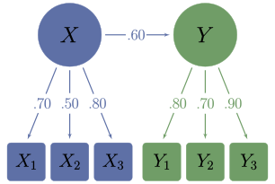

<!-- README.md is generated from README.Rmd. Please edit that file -->

```{r, include = FALSE}
knitr::opts_chunk$set(
  collapse = TRUE,
  comment = "#>",
  fig.path = "man/figures/README-",
  out.width = "100%",
  fig.width = 7.2916667,
  fig.height = 7.2916667
)
options(digits = 2)
library(unusualprofile)
```

# unusualprofile [{width=139 style="float: right;"}](https://wjschne.github.io/unusualprofile/)

<!-- badges: start -->

[](https://cran.r-project.org/package=unusualprofile) [](https://lifecycle.r-lib.org/articles/stages.html#stable) 


<!-- badges: end -->

The goal of unusualprofile is to calculate conditional Mahalanobis distances and related statistics. Such statistics can help find cases with unusual profiles of multivariate normal data.

# Installation

You can install the development version from [GitHub](https://github.com/) with:

``` r
# install.packages("remotes")
remotes::install_github("wjschne/unusualprofile")
```

# Example

To use the unusualprofile package, all that is needed is to know the correlations, means, and standard deviations among a set of continuous variables and at least one row of data from that set of variables.

Suppose we have set of variables that have the following relationships:



First, we load the unusualprofile package.

```{r}
library(unusualprofile)
```

Included with the unusualprofile package, the `d_example` data set has a single row of data generated from the path diagram depicted above.

```{r, echo=FALSE}
d_example
```

Also included with the unusualprofile package is the path diagram's model-implied correlation matrix:

```{r}
R_example
```

## Using the `cond_maha` function

We can specify the correlations (`R`), means (`mu`), standard deviations (`sigma`). independent variables (`v_ind`), and dependent variables (`v_dep`). In this case, the independent variables are composite scores summarizing the dependent variables.

```{r example}
# Conditional Mahalanobis distance
cm <- cond_maha(data = d_example, 
          R = R_example,
          mu = 0,
          sigma = 1,
          v_ind_composites = c("X", "Y"),
          v_dep = c("X_1", "X_2", "X_3",
                    "Y_1", "Y_2", "Y_3"))

cm

# Plot
plot(cm)
```
