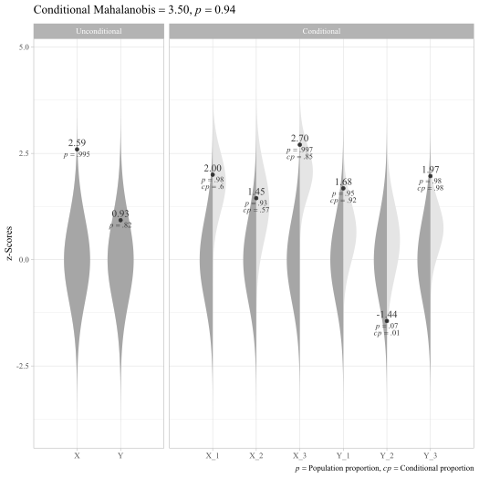

<!-- README.md is generated from README.Rmd. Please edit that file -->

# unusualprofile

<!-- badges: start -->

[](https://cran.r-project.org/package=unusualprofile)
[](https://www.tidyverse.org/lifecycle/#maturing)
[](https://travis-ci.org/wjschne/unusualprofile)
[](https://codecov.io/gh/wjschne/unusualprofile?branch=master)
<!-- badges: end -->

The goal of unusualprofile is to calculate conditional Mahalanobis
distances and related statistics. Such statistics can help find cases
with unusual profiles of multivariate normal data.

## Installation

You can install the development version from
[GitHub](https://github.com/) with:

``` r
# install.packages("devtools")
devtools::install_github("wjschne/unusualprofile")
```

## Example

Using the simstandard package, we generate 1 case from a standardized
multivariate normal data set.

``` r
library(unusualprofile)
library(simstandard)
library(ggnormalviolin)
library(dplyr)
set.seed(281)

# lavaan model with three indicators of a latent variable
model <- "
X =~ 0.7 * X_1 + 0.5 * X_2 + 0.8 * X_3
Y =~ 0.7 * Y_1 + 0.5 * Y_2 + 0.8 * Y_3
Y ~ 0.6 * X
"

# Randomly generated case
d <- sim_standardized(
  model, 
  n = 1, 
  observed = TRUE, 
  latent = FALSE, 
  errors = FALSE, 
  composites = TRUE) %>% 
  rename(X = "X_Composite",
         Y = "Y_Composite")


# Model-implied correlation matrix
R <- sim_standardized_matrices(model)$Correlations$R_all
```

Now we specify the correlations, independent variables, and dependent
variables. In this case, the indpendent variables are composite scores
summarizing the dependent variables.

``` r
# Conditional Mahalanobis distance
cm <- cond_maha(data = d, 
          R = R,
          v_ind = c("X_1", "X_2", "X_3"),
          v_dep = c("Y_1", "Y_2", "Y_3"))

cm
#> Conditional Mahalanobis Distance = 2.9295, df = 3, p = 0.9646

# Plot
plot_cond_maha(cm)
```


``` r

# Conditional Mahalanobis distance
cm <- cond_maha(data = d, 
          R = R,
          v_ind = c("X", "Y"),
          v_dep = c("X_1", "X_2", "X_3",
                    "Y_1", "Y_2", "Y_3"))

cm
#> Conditional Mahalanobis Distance = 3.5010, df = 6, p = 0.9435

# Plot
plot_cond_maha(cm)
```



``` r

unusualprofile::unusualness(d, model, 
                            v_dep = c("Y"),
                            v_ind = c("X")) %>% 
  mutate(Measure = stringr::str_replace(Measure, "\\$\\\\leftarrow\\$","&larr;")) %>% 
  knitr::kable(digits = 2) 
```

| Measure                                   |  dCM | dCM Percentile | dCM Level   |   dM | dM Percentile | dM Level  |
| :---------------------------------------- | ---: | -------------: | :---------- | ---: | ------------: | :-------- |
| Latent Dependent ← Latent Independent     | 0.78 |           0.57 | Average     | 0.93 |          0.65 | Average   |
| Observed Dependent ← Observed Independent | 2.93 |           0.96 | High        | 3.32 |          0.99 | Very High |
| Observed Dependent ← Latent Dependent     | 3.33 |           0.99 | Very High   | 3.32 |          0.99 | Very High |
| Observed Independent ← Latent Independent | 1.09 |           0.24 | Low Average | 2.78 |          0.95 | High      |
| All Observed ← All Latent                 | 3.50 |           0.94 | High        | 4.04 |          0.99 | Very High |
