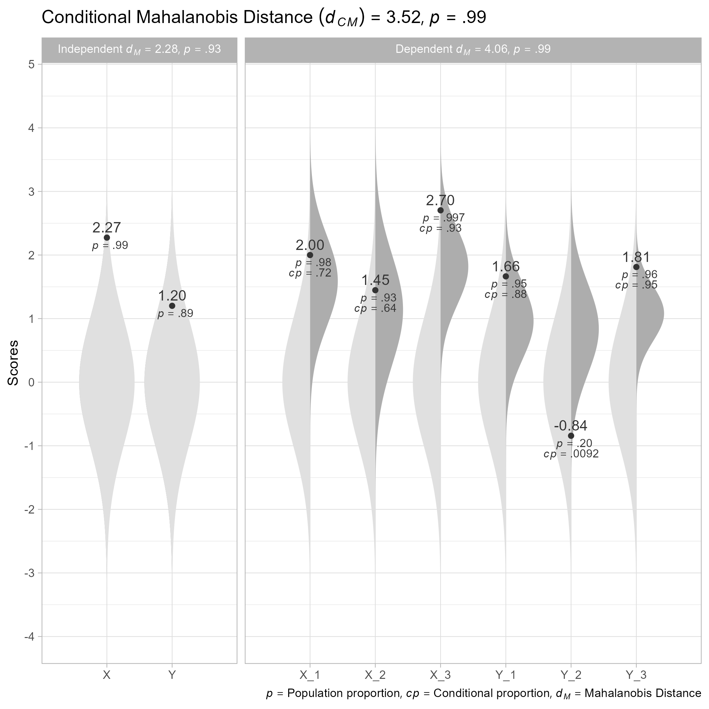

<!-- README.md is generated from README.Rmd. Please edit that file -->

# unusualprofile 

<!-- badges: start -->

[](https://cran.r-project.org/web/checks/check_results_unusualprofile.html)
[](https://lifecycle.r-lib.org/articles/stages.html#stable)
[](https://github.com/wjschne/unusualprofile/actions)
[](https://app.codecov.io/gh/wjschne/unusualprofile?branch=main)
<!-- badges: end -->

The goal of unusualprofile is to calculate conditional Mahalanobis
distances and related statistics. Such statistics can help find cases
that are unusual, even after controlling for specified predictors.

# Installation

You can install the development version from
[GitHub](https://github.com/) with:

``` r
# install.packages("remotes")
remotes::install_github("wjschne/unusualprofile")
```

# Example

To use the unusualprofile package, one needs to know the correlations,
means, and standard deviations among a set of continuous variables and
at least one row of data from that set of variables.

Suppose we have set of variables that have the following relationships:


First, we load the unusualprofile package.

``` r
library(unusualprofile)
```

Included with the unusualprofile package, the `d_example` data set has a
single row of data generated from the path diagram depicted above.

    #>        X_1     X_2      X_3      Y_1        Y_2      Y_3        X        Y
    #> 1 1.999498 1.44683 2.703249 1.664106 -0.8427126 1.811528 2.273441 1.201208

Also included with the unusualprofile package is the path diagram’s
model-implied correlation matrix:

``` r
R_example
#>       X_1  X_2   X_3   Y_1   Y_2   Y_3    X    Y
#> X_1 1.000 0.35 0.560 0.336 0.294 0.378 0.70 0.42
#> X_2 0.350 1.00 0.400 0.240 0.210 0.270 0.50 0.30
#> X_3 0.560 0.40 1.000 0.384 0.336 0.432 0.80 0.48
#> Y_1 0.336 0.24 0.384 1.000 0.560 0.720 0.48 0.80
#> Y_2 0.294 0.21 0.336 0.560 1.000 0.630 0.42 0.70
#> Y_3 0.378 0.27 0.432 0.720 0.630 1.000 0.54 0.90
#> X   0.700 0.50 0.800 0.480 0.420 0.540 1.00 0.60
#> Y   0.420 0.30 0.480 0.800 0.700 0.900 0.60 1.00
```

## Using the `cond_maha` function

We can specify the correlations (`R`), means (`mu`), standard deviations
(`sigma`). independent variables (`v_ind`), and dependent variables
(`v_dep`). In this case, the independent variables are composite scores
summarizing the dependent variables.

``` r
# Conditional Mahalanobis distance
cm <- cond_maha(data = d_example, 
          R = R_example,
          mu = 0,
          sigma = 1,
          v_ind_composites = c("X", "Y"),
          v_dep = c("X_1", "X_2", "X_3",
                    "Y_1", "Y_2", "Y_3"))

cm
#> Conditional Mahalanobis Distance = 3.5167, df = 4, p = 0.9852

# Plot
plot(cm)
```


