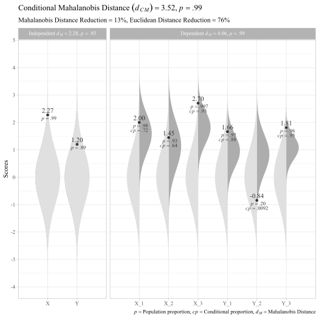

<!-- README.md is generated from README.Rmd. Please edit that file -->

# unusualprofile

<!-- badges: start -->

[](https://cran.r-project.org/package=unusualprofile)
[](https://www.tidyverse.org/lifecycle/#maturing)
[](https://travis-ci.org/wjschne/unusualprofile)
[](https://codecov.io/gh/wjschne/unusualprofile?branch=master)
<!-- badges: end -->

The goal of unusualprofile is to calculate conditional Mahalanobis
distances and related statistics. Such statistics can help find cases
with unusual profiles of multivariate normal data.

# Installation

You can install the development version from
[GitHub](https://github.com/) with:

``` r
# install.packages("remotes")
remotes::install_github("wjschne/unusualprofile")
```

# Example

To use the unusualprofile package, all that is needed is to know the
correlations, means, and standard deviations among a set of continuous
variables and at least one row of data from that set of variables.

Suppose we have set of variables that have the following relationships:


First, we load the packages that we will use later:

``` r
library(unusualprofile)
library(ggnormalviolin)
library(dplyr)
```

The case in the `d_example` data set was generated from the model
depicted above:

    #> # A tibble: 1 x 8
    #>     X_1   X_2   X_3   Y_1    Y_2   Y_3 X_Composite Y_Composite
    #>   <dbl> <dbl> <dbl> <dbl>  <dbl> <dbl>       <dbl>       <dbl>
    #> 1  2.00  1.45  2.70  1.66 -0.843  1.81        2.59        1.01

The model-implied correlation matrix:

``` r
R_example
#>              X_1  X_2  X_3  Y_1  Y_2  Y_3 X_Composite Y_Composite
#> X_1         1.00 0.35 0.56 0.34 0.29 0.38        0.81        0.39
#> X_2         0.35 1.00 0.40 0.24 0.21 0.27        0.74        0.28
#> X_3         0.56 0.40 1.00 0.38 0.34 0.43        0.83        0.44
#> Y_1         0.34 0.24 0.38 1.00 0.56 0.72        0.40        0.87
#> Y_2         0.29 0.21 0.34 0.56 1.00 0.63        0.35        0.84
#> Y_3         0.38 0.27 0.43 0.72 0.63 1.00        0.46        0.90
#> X_Composite 0.81 0.74 0.83 0.40 0.35 0.46        1.00        0.47
#> Y_Composite 0.39 0.28 0.44 0.87 0.84 0.90        0.47        1.00
```

## Using the `cond_maha` function

Now we specify the correlations (`R`), means (`mu`), standard deviations
(`sigma`). independent variables (`v_ind`), and dependent variables
(`v_dep`). In this case, the indpendent variables are composite scores
summarizing the dependent variables.

``` r
# Conditional Mahalanobis distance
cm <- cond_maha(data = d_example, 
          R = R_example,
          mu = 0,
          sigma = 1,
          v_ind_composites = c("X_Composite", "Y_Composite"),
          v_dep = c("X_1", "X_2", "X_3",
                    "Y_1", "Y_2", "Y_3"))

cm
#> Conditional Mahalanobis Distance = 3.1117, df = 4, p = 0.9539

# Plot
plot_cond_maha(cm)
```


