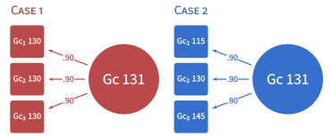

```{r setup, include = FALSE}
knitr::opts_chunk$set(
  collapse = TRUE,
  comment = "#>",
  dev = "svg",
  out.height = "100%",
  out.width = "100%",
  fig.width = 7,
  fig.height = 7
)
```

# Motivation

This package automates the process of making sense of psychoeducational test batteries results for practitioners/school psychologists, using latent-variable-based methods [@ji2018].

# Estimating factor scores

Factor scores are calculated using Thurstone's method [@thurstone1935vectors; @schneider2013if]:

$$\hat{a}_{i}= R_{XX}\Lambda R_{YY}^{-1}y_{i}=R_{XY}R_{YY}^{-1}y_{i}$$

Where

$\hat{a}_{i}$ is a random vector of the ith subject’s factor scores estimate on the common factors.  
$R_{XX}$ is the correlation matrix among the latent factors.  
$\Lambda$ is the factor-pattern matrix.  
$R_{XY}$ is a correlation matrix between the common factors and the observed	variables.  
$R_{YY}^{-1}$ is the inverse of the correlation matrix among the observed variables.  
$y_{i}$ is a random vector of the ith subject’s standardized scores on the observed variables.

# Predicting individual's unusualness in population 

$$d_{cM}=\sqrt{(Z_{o}-\hat{Z}_{o})'R_o^{-1}(Z_{o}-\hat{Z}_{o})}$$
$\hat{Z}_{o}$ is the vector of predicted outcome scores (i.e., the predicted academic abilities predicted by the
factor scores of cognitive abilities).  
$Z_{o}$ is the vector of outcome scores (i.e., the factor scores of academic abilities estimated from our
SEM).  
$R_o^{-1}$ is the matrix of conditional variance among the factor scores (the composite correlation
between factor scores calculated using population correlation among observed scores, that is, $\beta'\Sigma_{xx}\beta$,
where $\beta=\Sigma_{yx}\Sigma_{xx}^{-1}$. If multivariate normality can be assumed and there are $k$ outcome scores,  
$$d_{cM}^{2} \sim\chi^{2}(k)$$  

# A worked example

```{r, echo = FALSE}

```

```{r, message=FALSE}
library(tidyverse)
library(magrittr)
library(unusualprofile)

# Make data
m = "Gc =~ 0.9 * Gc_1 + 0.9 * Gc_2 + 0.9 * Gc_3"
d_data <- simStandardized(m = m,
                          n = 10000)

# Make case 1 and 2
d_case <- matrix(
  c(2, 2, 2,
    1, 2, 3), 
  2, byrow = T) %*%
  cbind(diag(3), d_data$FactorScoreCoef[, "Gc"]) %>%
  set_colnames(c(paste0("Gc_", 1:3), "Gc_FS")) %>%
  as_tibble() %>%
  mutate(Gc = Gc_FS / d_data$FactorScoreValidity["Gc"])

# Calculate d_CM
d_CM <- CMahalanobis(
  d = d_case,
  R = d_data$R_all,
  Dep = paste0("Gc_", 1:3),
  Ind = "Gc",
  UseFactorScores_Ind = T
)
d_M <-
  CMahalanobis(
    Dep = paste0("Gc_", 1:3),
    R = d_data$R_all,
    d = d_case %>% select(-Gc)
  )

# Make Table 3
d_case %>%
  select(-Gc) %>%
  mutate_all(function(x)
    x * 15 + 100) %>%
  mutate(pdM = as.vector(d_M$p),
         pdCM = as.vector(d_CM$p),
         Case = 1:2) %>%
  select(Case, everything()) %>%
  magrittr::set_colnames(
    c(
      "$\\text{Case}$",
      "$Gc_1$",
      "$Gc_2$",
      "$Gc_3$",
      "$\\hat{G}c$",
      "$\\text{P}(d_M)$",
      "$\\text{P}(d_{CM})$"
    )
  ) %>%
  knitr::kable(digits = c(0,0,0,0,1,3,3), align = "lcccccc")
```


We can use the proposed method to make sense of observed scores. If the observed scores of the three tests measuring Gc are all 130, we can calculate the (unconditional) Mahalanobis distance to show that the profile of the three scores would be less usual than about 80% of the population (see Table). If the observed scores of the three tests measuring Gc are 115, 130 and 145, the profile would be less usual than 99.8% of population. We can see from this case that although they have equal averages, their unusualness is quite different. The problem with the traditional Mahalanobis distance is that both profiles are unusual because the scores, on average, are 2 standard deviations above the mean. With the proposed conditional Mahalanobis distance (conditioned on the estimated factor score of 130.9), we would see in Table 3 that Case 2, with a variable profile, is still more unusual than 98.5% of profiles with the same factor score. Case 1—with equal scores conditioned on an equally weighted factor score—is the least unusual profile possible.  Thus, with the conditional Mahalanobis distance, one can distinguish between profiles that are unusual because of elevation and those that are unusual because of variability in their shape.

# References

