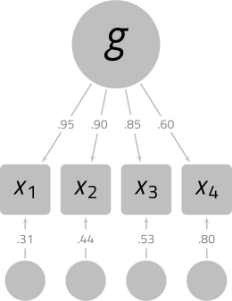
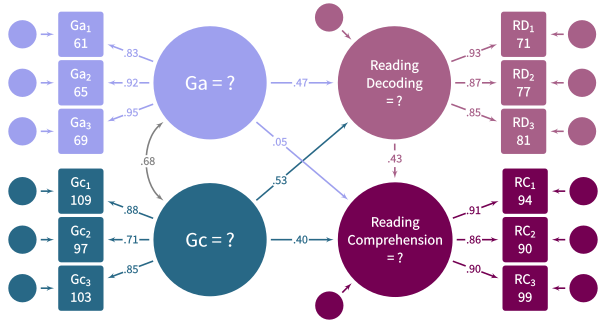

```{css, echo = FALSE}

@import url('http://fonts.googleapis.com/css?family=Titillium+Web');
body {font-family: 'Titillium Web', 'Open Sans', 'sans-serif'; font-size:18px; line-height:1.25;}

```

```{r setup, include = FALSE}

knitr::opts_chunk$set(
  collapse = TRUE,
  comment = "#>",
  dev = "svg",
  out.height = "100%",
  out.width = "100%",
  fig.width = 7.2916667,
  fig.height = 7.2916667,
  message = FALSE,
  warning = FALSE,
  cache = TRUE
)

options(digits = 2)

library(extrafont)
library(dplyr)
library(tidyr)
library(forcats)
library(stringr)
library(tibble)
library(magrittr)
library(unusualprofile)
library(simstandard)
library(knitr)
library(kableExtra)
library(ggplot2)

library(showtext)
library(purrr)

myfont <- "Titillium Web"

font_add_google("Titillium Web", "Titillium Web")
theme_set(theme_minimal(16, base_family = myfont))
update_geom_defaults(geom = "text",
                     new = list(family = myfont))
update_geom_defaults(geom = "label",
                     new = list(family = myfont))
update_geom_defaults(geom = "point",
                     new = list(pch = 16))
#Rounds proportions to significant digits both near 0 and 1
PropRound <- function(p, maxDigits = 10) {
  d <- rep(2, length(p))
  pp <- rep(0, length(p))
  for (i in seq(1, length(p))) {
    if (p[i] > 0.99 | p[i] < 0.01) {
      d[i] <-
        min(maxDigits, 1 - 1 - floor(log10(abs(
          ifelse(p[i] < 0.5, p[i], 1 - p[i])
        ))))
    }
    pp[i] = formatC(round(p[i], digits = d[i]), digits = d[i], flag = "")
    if (round(p[i], digits = maxDigits) == 0) {
      pp[i] = 0
    }
    if (round(p[i], digits = maxDigits) == 1) {
      pp[i] = 1
    }
    gsub(" ", "", pp[i])
  }

  return(gsub(" ", "", pp))
}

numText <- function(x, digits = 2) {
  str_replace(formatC(x, digits = digits, format = "f"), pattern = "\\-","−")
}

bmatrix <- function(x, digits = 2) {
  x_formatted <- apply(x, 1, formatC, digits = digits, format = "f")
  x_formatted <- apply(x_formatted, 1, str_remove, pattern = "^0")
  x_formatted[x == 0] <- "0"
  x_formatted[x == 1] <- "1"
  paste0("\\begin{bmatrix}\n", 
         paste0(apply(x_formatted,
                      MARGIN = 1,
                      FUN = paste0, 
                      collapse = " & "), 
                collapse = "\\\\\n"), 
         "\n\\end{bmatrix}")
}

```


The unusualprofile package automates the process of making sense of psychoeducational test batteries results using latent-variable-based methods [@ji2018].

# Univariate Outliers

A univariate outlier is far from most of the other scores in a distribution. You can easily spot a large outlier in a histogram:

```{r univariate, echo= FALSE}

set.seed(1)
data.frame(x = c(rnorm(100), 10)) %>% 
  mutate(Outlier = between(x,-5,5) %>%
           factor(levels = c(FALSE, TRUE),
                  labels = c("Outlier", 
                             "Non-Outliers"))) %>% 
  ggplot(aes(x = x, fill = Outlier)) + 
  geom_histogram(binwidth = 0.5) + 
  scale_fill_manual(NULL, values = c("firebrick", "gray40")) +
  scale_x_continuous(NULL, breaks = seq(-4,10,2)) +
  theme(legend.position = "none") +
  xlab(NULL) + 
  ylab(NULL) +
  annotate(10,1, 
           geom = "label", 
           label = "Outlier", 
           vjust = -0.5, 
           label.size = 0, 
           label.padding = unit(0,"mm"), 
           family = myfont) 

```

If we want to quantify the degree of unusualness of the univariate outlier, we could convert the outlier to a *z*-score, which would indicate the distance in standard deviation units of the outlier from the mean of the distribution. In this case, the outlier is 10 standard deviation units from the mean of the other scores.

# Multivariate Outliers

A univariate outlier refers to a single case on a single variable. A multivariate outlier refers to a single row of data on 2 or more variables. 

A multivariate outlier might not be unusual on any particular variable, but has an unusual *pattern* of scores. For example, in the plot below, the red point is not very unusual in a univariate context---just 1 standard deviation from the mean of either variable. However, because *x* and *y* are highly correlated, it is extremely rare for a data point to differ by 2 standard deviations.

```{r multivariate, echo=FALSE, warning=FALSE}
set.seed(5)
d_mo <- mvtnorm::rmvnorm(n = 1000, sigma = matrix(c(1,0.95,0.95,1),2))
d_mo[100,] <- c(-1,1)
d_mo <- data.frame(d_mo)
colnames(d_mo) <- c("x","y")
ggplot(d_mo, aes(x, y)) + 
  geom_point(alpha = 0.2, size = 2, pch = 16) + 
  geom_point(data = d_mo[100,],color = "firebrick", size = 3) + 
  coord_equal(xlim = c(-4,4), ylim = c(-4,4)) + 
  theme(axis.title.y = element_text(angle = 0, vjust = .5, face = "italic"),
        axis.title.x = element_text(face = "italic"))
```

Scatterplots are great for inspecting multivariate outliers with a small number of variables. Unfortunately, scatterplots can only display 2 or 3 variables at a time. A different way to view multivariate data is to show each case as a profile of scores connected by lines. In the plot below, most of the lines are nearly flat---highly correlated variables with the same means and standard deviations will generally produce flat profiles. The multivariate outlier, in red, is clearly not flat.

```{r profiles, echo= FALSE}
k <- 400
head(d_mo, k) %>% 
  rowid_to_column("id") %>%
  as_tibble(.name_repair = "unique") %>% 
  gather(key, value, -id) %>% 
  mutate(Outlier = id == 100,
         key = factor(key),
           x = as.numeric(key) + 0.2 * runif(k,min = -1,1) * dnorm(value)) %>%
  arrange(-Outlier) %>% 
  ggplot(aes(key, value, group = id)) + 
  ggnormalviolin::geom_normalviolin(
    data = tibble(
      mu = c(0,0), 
      sigma = c(1,1), 
      x = c("x","y")), 
    aes(
      x = x, 
      mu = mu, 
      sigma = sigma), width = 0.2,
    inherit.aes = F) + 
  geom_line(alpha = 0.25, size = 0.25, aes(x = x, group = id)) +
  geom_point(alpha = 0.25, size = 0.75, aes(x = x)) +
  scale_size_manual(values = c(0.5,2)) + 
  annotate(x = "x",  
           y = -1, 
           xend = "y", 
           yend = 1, 
           geom = "segment", 
           color = "firebrick",
           size = 1) +
  annotate(x = c("x","y"), 
           y = c(-1,1), 
           color = "firebrick", 
           geom = "point", 
           size = 2) +
  scale_x_discrete(NULL, expand = expand_scale(0,.25)) + 
  scale_y_continuous(NULL) +
  theme(axis.text.x = element_text(face = "italic"))

```

Suppose that we have four variables, all standard normal. Because the four variables correlate at 0.99, the profiles are all quite flat. However, the red profile {1,1,&minus;1,1} is much less flat, making it unusual in this context. 

```{r, echo=FALSE}
vnames <- paste0("x_",1:4)
n <- 300
rho <- matrix(0.99, nrow = 4, ncol = 4, dimnames = list(vnames, vnames))
diag(rho) <- 1

d_4 <- mvtnorm::rmvnorm(sigma = rho, n = n) %>% 
  as_tibble(.name_repair = "unique") %>% 
  set_colnames(vnames)

d_4[1,] <- c(1, 1, -1, 1)

d_4 %>% 
  mutate(id = 1:n) %>% 
  gather(key, value, -id) %>% 
  mutate(key = factor(key),
           x = as.numeric(key) + 0.25 * runif(n,min = -1,1) * dnorm(value)) %>% 
  ggplot(aes(key, value, group = id)) + 
  ggnormalviolin::geom_normalviolin(
    data = tibble(
      mu = 0, 
      sigma = 1, 
      x = paste0("x_", 1:4)),
    aes(
      x = x, 
      mu = mu, 
      sigma = sigma), 
    width = 0.25,
    inherit.aes = F) + 
  geom_line(alpha = 0.2, size = 0.25, aes(group = id, x = x)) + 
  geom_point(alpha = 0.3, size = 0.75, aes(x = x)) + 
  geom_line(data = . %>% filter(id == 1),
            color = "firebrick", size = 0.5) +
  geom_point(data = . %>% filter(id == 1),
             size = 1.25, color = "firebrick") + 
  scale_x_discrete(NULL, 
                   expand = c(0.06,0), 
                   labels = parse(text = paste0("italic(x)[",1:4,"]"))) + 
  scale_y_continuous(NULL)
```

In the plot above, we can see plainly that the red profile is unusual. However, we cannot yet tell exactly how unusual it is. We would like a measure of its unusualness.

# Quantifying Unusualness

## The Euclidean Distance

The simplest (but ultimately unsatisfying) way to measure a profile's unusualness is with the Euclidean distance. A multidimensional extension of the Pythagorean Theorem, the *Euclidean distance* is the square root of the sum of the squared differences on each dimension from some reference point. The reference point of interest is usually the vector of means from each variable---the *centroid*. The Euclidean distance of point *p*~1~ = (1,1,&minus;1,1) to the centroid *p*~2~ = (0,0,0,0)  is

$$\sqrt{(p_1-p_2)'(p_1-p_2)}=\sqrt{(1-0)^2+(1-0)^2+(-1-0)^2+(1-0)^2}=2$$

The Euclidean distance of point (1,1,1,1) to the centroid is also 2, yet if the two variables are highly correlated, point (1,1,&minus;1,1) is much more unusual than point (1,1,1,1). Though fairly simple to calculate, the Euclidean distance is insensitive to the relationships among the variables, making it a poor choice for quantifying the unusualness of profiles of correlated variables.

## The Mahalanobis Distance

In 1936, P. R. Mahalanobis introduced a variant of the Euclidean distance that accounts for the covariance of the variables. Conceptually, the *Mahalanobis distance* is a Euclidean distance of profile scores if the variables are rotated and rescaled to fit on their principal component axes. Because principal components are always uncorrelated, distances in principal component space always have the same meaning regardless of the relationsips of the original variables.

Computationally, the principal components need not be calculated explicitly. We simply need to invert the covariance matrix of the profile variables:

$$d_{M}=\sqrt{(X-\mu_X)'\Sigma_X^{-1}(X-\mu_X)}$$

Where

>$d_M$ is the Mahalanobis distance  
$X$ is a vector of variable scores  
$\mu_X$ is the vector of variable means of $X$ (i.e., the centroid of $X$)  
$\Sigma_X$ is the covariance matrix of the variables in vector $X$

If the variables in *X* are normally distributed, essentially the Mahalanobis distance is creating principal component scores that are uncorrelated standard normal variates, squaring each score, and then summing each row of scores. Adding squared uncorrelated standard normal variates just so happens to be how the &chi;^2^ distribution is made. The degrees of freedom in the &chi;^2^ distribution corresponds to the number of standard normal variates that are squared and summed.

Thus, if there are *k* normally distributed variables in vector *X*, the Mahalanobis distance squared for vector *X* has a &chi;^2^ distribution with *k* degrees of freedom. In mathematical notation:

$$d_M ^ 2 \sim \chi^2(k)$$

Thus, if we can assume the profile variables are multivariate normal, we can use the cumulative distribution function of the &chi;^2^ distribution to quantify how unusual a particular profile compares to the general population of profiles.

Suppose that a Mahalanobis distance for a row of data from 5  standard normal variates is 15.5. The cumulative distribution function for the &chi;^2^ distribution with 5 degrees of freedom is `r round(pchisq(15.5,5), 3)`. Thus, the row of data is a multivariate outlier.

# Conditional Mahalanobis Distances

One the disadvantages of the Mahalanobis Distance is that it treats all the principal component dimensions equivalently. For highly correlated variables, the first principal component (or general factor) is of particular importance. We might want to distinguish between cases that are unusual on the first principal component and scores that are unusual on the remaining principal components.

For example, in a distribution of 4 highly correlated standardized variables, the point (4,4,4,4) is unusual because each point is unusual---four standard deviations above the mean. However, after accounting for its extreme elevation, the profile is perfectly flat. That is, the profile is unusually elevated, but has the modal profile shape. Of course, a perfectly flat profile is unusual in a different sense. It is *extremely flat* in the same sense that a score equal to the mean is *extremely average*.

In contrast, the point (&minus;4, 4, &minus;4, 4) is perfectly average in its elevation---the scores average to 0. It has, however, an unusually uneven shape.

## Distinguishing Profile Shape from Profile Elevation

One way to define the profile elevation is to create a composite score from the sum of profile variables. All profiles that produce the same composite score are defined to have the same profile elevation. For ease of computation, the profile variables and the composite score can be re-scaled to have the same metric---preferably the *z*-score metric.

Suppose that we compare all profiles that have the same elevation but have different profile shapes. Imagine that four standardized variables correlate according to the structural model below, and we select a subset of cases in which the profiles have an elevation of 1 (i.e., their composite score has a *z*-score of 1).

```{r, echo = FALSE, fig.align='center', fig.cap="A simple model with standardized loadings", out.width=300}

```

In the plot below, two score profiles with an elevation of 1 are shown. The red profile is flat and unremarkable, whereas the blue profile is unusually uneven.

```{r, echo = FALSE}
library(ggnormalviolin)
set.seed(1000)
elevation <- 1
lambda <- c(0.95, 0.90, 0.85, 0.60)
Ryy <- lambda %*% t(lambda)
diag(Ryy) <- 1
w <- cbind(diag(4), rep(1,4))
rho <- cov2cor(t(w) %*% Ryy %*% w)
drho <- round(rho, 2)
diag(drho) <- 1
Rxx <- matrix(1)
Ryx <- rho[1:4, 5, drop = F]
cov_cond <- Ryy - Ryx %*% solve(Rxx) %*% t(Ryx)
# d <- mvtnorm::rmvnorm(n = 30, sigma = cov_cond)  + rho[5,1:4]

d <- matrix(c(1.62, 1.75,-.19,
              .82, .75, 1.07), nrow = 2, byrow = TRUE)
d <- cbind(d, sum(rho[5, 1:4]) - rowSums(d))

colnames(d) <- paste0("x",1:4)
colnames(rho) <- rownames(rho) <- c("x1","x2","x3","x4","Composite")
CM <- cond_maha(d %>% as_tibble(.name_repair = "unique") %>% mutate(Composite = 1), 
          R = rho, 
          v_dep = colnames(d)[-5], 
          v_ind = "Composite")

d %>% 
  as_tibble(.name_repair = "unique") %>% 
  rowid_to_column(var = "id") %>% 
  mutate(id = factor(id),
         pdM = PropRound(CM$dCM_p)) %>% 
  gather("Variable","X",-id, -pdM) %>% 
  ggplot(aes(Variable, X)) + 
  geom_normalviolin(
    aes(
      x = id,
      mu = mu, sigma = sigma), 
    data = tibble(id = factor(c("x1","x2","x3","x4")),
                  mu = rho[5,1:4],
                  sigma = sqrt(diag(cov_cond))), 
    inherit.aes = F,
    alpha = 0.5, 
    upper_limit = 3) +
  geom_line(aes(group = id, 
                color = id), 
            alpha = 1, 
            size = 1) + 
  geom_hline(yintercept = 1) +
  geom_point(aes(color = id), size = 2.5) +
  geom_text(aes(label = numText(X,2),
                color = id,
                vjust = if_else(X > 1, -0.8, 1.5)),
            size = 5) +
  # geom_text(data = . %>% filter(Variable == "x1"), 
  #           aes(label = paste0("italic(p) == ", pdM),
  #               color = id), 
  #           parse = TRUE,
  #           hjust = 1.15, 
  #           size = 5) +
  scale_y_continuous(NULL, breaks = -3:3) +
  scale_x_discrete(
    NULL, 
    label = parse(text = paste0("italic(x)[",1:4,"]"))) +
  scale_color_manual(values = c("steelblue","firebrick")) + 
  annotate("text", 
           x = 4.15, 
           y = 1, 
           label = "Composite == 1", 
           parse = TRUE, 
           vjust = -0.1,
           size = 5) + 
  annotate(
    "label", 
    x = 1.5, 
    y = 2.75, 
    label = paste0(
      "More unusual than ", 
      round(CM$dCM_p[1] * 100), 
      "% of\nprofiles with the same elevation"), 
    color = "steelblue", 
    label.padding = unit(0, "lines"), 
    label.size = 0, 
    size = 6, 
    lineheight = 0.85) +
  annotate(
    "label", 
    x = 1.5, 
    y = -0.75, 
    label = paste0(
      "More unusual than ", 
      round(CM$dCM_p[2] * 100), 
      "% of\nprofiles with the same elevation"), 
    color = "firebrick", 
    label.padding = unit(0, "lines"), 
    label.size = 0, 
    size = 6, 
    lineheight = 0.85) +
  annotate(
    "segment", 
    x = 1.5, 
    y = -0.4, 
    xend = 1.55, 
    yend = 0.7,
    size = 1, 
    color = "firebrick", 
    arrow = arrow(length = unit(0.35,"cm"), 
                  angle = 17, type = "closed")) +
  annotate(
    "segment", 
    x = 1.5, 
    y = 2.4, 
    xend = 1.56, 
    yend = 1.75, 
    size = 1, color = "steelblue", 
    arrow = arrow(length = unit(0.35,"cm"), 
                         angle = 17, type = "closed")) + 
  ggtitle("Two profiles with the same elevation but different shapes") + 
  theme(legend.position = "none") +
  coord_cartesian(ylim = c(-3,3))

```

## Calculate correlation matrix

How can we calculate the Mahalanobis distance for profiles that all have the same elevation? First we need to calculate the composite score's correlation with each score.

First we need to specify the model using [lavaan syntax](http://lavaan.ugent.be/tutorial/syntax1.html):

```{r}
model <- "g =~ 0.95 * x_1 + 0.90 * x_2 + 0.85 * x_3 + 0.60 * x_4"
```

Using the simstandard package, we can find the model-implied correlation matrix.

```{r}
library(simstandard)

# Fit object
fit <- sim_standardized_matrices(model)

# Observed Variable Names
v_observed <- fit$v_names$v_observed

# Model-implied correlations of observed variables
R_x <- fit$Correlations$R_all[v_observed,v_observed]
R_x
```

Thus,

```{r, results='asis', echo = FALSE}
cat(paste0("$$R_{X} \\approx ",bmatrix(R_x[v_observed,v_observed]),"$$"))
```

We need to use this matrix to create a new 5 &times; 5 correlation matrix that includes the correlations among the four variables and also each variable's correlation with the general composite score (i.e., the standardized sum of four variables). Fortunately, such a matrix can be calculated with only a few steps. 

We will need a "weight" matrix that will select each variable individually and also the sum of the four variables. 

$$w=\begin{bmatrix}
1 & 0 & 0 & 0 & 1\\
0 & 1 & 0 & 0 & 1\\
0 & 0 & 1 & 0 & 1\\
0 & 0 & 0 & 1 & 1
\end{bmatrix}$$


Notice that the first column of this matrix has a 1 in first position and zeroes elsewhere. It selects the first variable, *X*~1~. The second column selects *X*~2~, and so on to the fourth column. The last column is all ones, which will select all four variables and add them up.

We can construct this matrix with the `diag` function, which creates an identity matrix. This matrix is appended to a column of ones:

```{r}
w <-  cbind(diag(4),
            rep(1,4))
w
```

Now we can use the weight matrix *w* to calculate the covariance matrix:

$$\Sigma = w'R_{X}w$$

```{r}
Sigma <- t(w) %*% R_x %*% w
Sigma
```

```{r, results='asis', echo = FALSE}
cat(paste0("$$\\Sigma \\approx ",bmatrix(Sigma),"$$"))
```

Now we need to convert the covariance matrix to a correlation matrix. With matrix equations, we would need to create a matrix of with a vector of variances on the diagonal:

$$D = \text{diag}(\Sigma)$$
Then we would take the square root, invert this matrix, and then pre-multiply it and post-multiply it by the covariance matrix.

$$R_{All} = D^{-0.5}\Sigma D^{-0.5}$$

```{r, results='asis', echo = FALSE}
cat(paste0("$$R_{All} \\approx ",bmatrix(drho),"$$"))
```

Fortunately, all this complication of converting covariances to correlations can be sidestepped by using the `cov2cor` function:

```{r}
R_all <- cov2cor(Sigma)
R_all
```

Calculating the necessary correlations from start to finish:

```{r}
library(simstandard)

# Standardized model
model <- "g =~ 0.95 * x_1 + 0.90 * x_2 + 0.85 * x_3 + 0.60 * x_4"

# Standardized model fit object
fit <- sim_standardized_matrices(model)

# Observed Variable Names
v_observed <- fit$v_names$v_observed

# Model-implied correlations of observed variables
R_x <- fit$Correlations$R_all[v_observed,v_observed]

# Weight matrix
w <-  cbind(diag(4),rep(1,4))

# Covariance matrix with composite score
Sigma <- t(w) %*% R_x %*% w

# Correlation matrix with composite score
R_all <- cov2cor(Sigma)
```

## Calculate composite scores

To calculate the standardized composite score $z_C$, add each variable's deviation from its own mean and divid by the square root of the sum of the observed score covariance matrix.

$$z_C=\frac{1'(x-\mu_X)}{\sqrt{1'\Sigma_X1}}$$

Where

 >$z_C$ is the vector of standardized composite scores.  
 $x$ is the vector of observed scores  
 $\mu_X$ is the vector of means for the $X$ variables  
 $\Sigma_X$ is the covariance matrix of the $X$ variables
 $1$ is a vector of ones compatible with $\Sigma_X$

## Estimate expected test scores conditioned on a composite score

Given a particular composite score, we need to calculate a predicted score. That is, if the composite score is 1.5 standard deviations above the mean, what are the expected subtest scores?

To make the calculations simple, assume that all scores---including the composite score---have been standardized to have a mean of 0 and a standard deviation of 1.

$$\hat{x}=\sigma_Xz_Cr_{XX_C}+\mu_X$$

Where

>$\hat{X}$ is the vector of expected subtest scores  
$C$ is the composite score  
$r_{XX_C}$ is a vector of correlations of each variable in $X$ with the composite score $X_C$

## Calculating the Conditional Mahalanobis Distance

$$d_{M_C}=\sqrt{\left(X-\hat{X}\right)'\Sigma_{X}^{-1}\left(X-\hat{X}\right)}$$

Where

>$d_{M_C}$ is the Conditional Mahalanobis Distance  
$X$ is a vector of subtest scores  
$\hat{X}$ is the vector of expected subtest scores  
$\Sigma_{X}$ is the covariance matrix of the subtest scores


Suppose there are *k* outcome scores, and *j* composite scores used to calculate the expected scores $\hat{X}$. If multivariate normality of the subtest scores can by assumed, then the Conditional Mahalanobis Distance squared has a *&chi;*^2^ distribution with *k* &minus; *j* degrees of freedom.

$$d_{M_C}^{2} \sim\chi^{2}(k-j)$$

# Computational Example

Suppose that

$$x=\{x_1,  x_2, x_3, x_4\} = \{1, 1, -1, -1\}. $$

```{r}

```


# Estimating factor scores

Factor scores are calculated using Thurstone's method [@thurstone1935vectors; @schneider2013if]:

$$\hat{a}= R_{XX}\Lambda R_{YY}^{-1}y=R_{XY}R_{YY}^{-1}y$$

Where

> $\hat{a}$ is a random vector of a person's estimated factor scores.  
$R_{XX}$ is the correlation matrix among the latent factors.  
$\Lambda$ is the factor-pattern matrix.  
$R_{XY}$ is a correlation matrix between the common factors and the observed	variables.  
$R_{YY}^{-1}$ is the inverse of the correlation matrix among the observed variables.  
$y$ is a random vector of a person's standardized scores on the observed variables.

# Predicting individual's unusualness in population 

$$d_{C M}=\sqrt{(y-\hat{y})'R^{-1}(y-\hat{y})}$$

Where

> $\hat{y}$ is the vector of predicted outcome scores (i.e., the predicted academic abilities predicted by the factor scores of cognitive abilities).  
$y$ is the vector of outcome scores (i.e., the factor scores of academic abilities estimated from our SEM).  
$R$ is the matrix of conditional variance among the factor scores (the composite correlation between factor scores calculated using population correlation among observed scores, that is, $\beta'\Sigma_{xx}\beta$,
where $\beta=\Sigma_{yx}\Sigma_{xx}^{-1}$. 


If multivariate normality can be assumed and there are *k* outcome scores,

$$d_{M_C}^{2} \sim\chi^{2}(k)$$  

# A Worked Example

Suppose we have two cognitive predictors of reading, General Comprehension/Knowledge (Gc) and General Auditory Processing (Ga). These cognitive abilities are precursor abilities to Reading Decoding (RD) and Reading Comprehension (RC). Each cognitive and academic ability is measured with three tests each. The theoretical model of how each variable relates to every other variable is shown below.

```{r, echo = FALSE, fig.align='center', fig.cap="General Comprehension/Knowledge (Gc) and General Auditory Processing (Ga) Predict Reading Decoding and Reading Comprehension"}

```

Here we load packages we will need and create a function for converting raw scores with a specific population mean and standard deviation to *z*-scores:

```{r load}
library(tibble)
library(tidyr)
library(dplyr)
library(purrr)
library(knitr)
library(kableExtra)
library(unusualprofile)

# Function to create *z*-scores
zscore <- function(x, mean = 100, sd = 15) (x - mean) / sd
```

We can use syntax from the lavaan package to specify the standardized coefficients of our model.

```{r model}
# Model of Reading
m_Reading <- "
Ga =~ 0.83 * Ga1 + 0.92 * Ga2 + 0.95 * Ga3
Gc =~ 0.88 * Gc1 + 0.71 * Gc2 + 0.85 * Gc3
RD =~ 0.93 * RD1 + 0.87 * RD2 + 0.85 * RD3
RC =~ 0.91 * RC1 + 0.86 * RC2 + 0.90 * RC3
Ga ~~ 0.68 * Gc
RD ~  0.47 * Ga + 0.53 * Gc
RC ~  0.05 * Ga + 0.40 * Gc  + 0.43 * RD
"
```

We are going to need several bits of information about this model. We will call the `sim_standardized_matrices` function from the simstandard package. In particular, we need the correlation matrix implied by our model.

```{r fit}
fit_Reading <- simstandard::sim_standardized_matrices(m_Reading)
R <- fit_Reading$Correlations$R_all
```

Here we enter the standard scores (Mean = 100, SD = 15) for a single person. Then we convert each standard score to *z*-scores. Finally, we use the simstandard package's `add_factor_scores` function to add estimated factor scores to the data frame.

```{r scores}
d_case <- tibble(
  Ga1 = 71,
  Ga2 = 65,
  Ga3 = 74,
  Gc1 = 108,
  Gc2 = 123,
  Gc3 = 99,
  RD1 = 77,
  RD2 = 71,
  RD3 = 80,
  RC1 = 90,
  RC2 = 84,
  RC3 = 107
) %>% 
  mutate_all(zscore, mean = 100, sd = 15)

fit_reading <- simstandard::sim_standardized_matrices(m_Reading)
composite_matrix <- fit_reading$Coefficients$composite_score
d_composites <- as.matrix(d_case) %*% composite_matrix

d_all <- cbind(d_case, d_composites)

d_all %>% 
        gather("Ability","z-score") %>% 
  mutate(SS = as.integer(`z-score` * 15 + 100)) %>%
  select(Ability,SS, `z-score`) %>% 
  kable(digits = 2, 
        caption = "Case Scores") %>%
  kableExtra::kable_styling(., bootstrap_options = "striped")
```

## Indicator Scores

Suppose that we want to know if the academic performance scores are unusual, given the cognitive predictor scores.

First, let's see if the observed score profile is unusual. We can calculate the (unconditional) Mahalanobis distance by putting all the observed variables as dependent variables:

```{r}
v_Reading <- c("RD1","RD2","RD3","RC1","RC2","RC3")
v_Cognitive <- c("Ga1","Ga2","Ga3","Gc1","Gc2","Gc3")

cond_maha(
  data = d_all, 
  R = R, 
  v_dep = c(v_Reading, v_Cognitive))
```

From the probability (p), we see that the overall observed score profile is quite unusual. 

```{r, echo=FALSE}
d_case %>% 
  gather("Variable","Score", factor_key = T) %>% 
  mutate(Score = Score * 15 + 100,
         Ability = str_sub(Variable, 1,2),
         Test = str_sub(Variable,3,3)) %>% 
  mutate(Ability = str_sub(Variable,1,2) %>% 
           factor(levels = c("Ga","Gc","RD","RC"), labels = c("Auditory Processing (Ga)","Verbal Knowledge (Gc)","Reading Decoding","Reading Comprehension"))) %>% 
  ggplot(aes(Test, Score,fill = Ability)) + 
  geom_normalviolin(aes(mu = 100, sigma = 15), width = 0.8, p_tail = 0.05) +
  geom_hline(yintercept = 100, color = "gray20") + 
  geom_line(aes(group = Ability)) +
  geom_point(size = 8) + 
  geom_text(aes(label = Score), color = "white", size = 3.25) + 
  facet_grid(cols = vars(Ability)) +
  theme_light(base_family = myfont, base_size = 14) +
  scale_y_continuous(breaks = seq(40,160,15)) +
  scale_x_discrete() +
  coord_cartesian(ylim = c(55,145)) +
  theme(legend.position = "none",
        strip.text = element_text(size = 10))
  
```


Now, let's see if the academic scores are unusual by themselves:

```{r}
cond_maha(
  data = d_case, 
  R = R, 
  v_dep = v_Reading)
```

A little less unusual, but still unusual.

Now let's see if the academic scores are unusual after controlling for the cognitive predictors:

```{r dCM_observed}
dCM <- cond_maha(
  data = d_case, 
  R = R, 
  v_dep = v_Reading, 
  v_ind = v_Cognitive) 
dCM

```

Controlling for the cognitive predictors, did not alter our conclusion that the reading profile is unusual. It appears that the Reading scores are more unusual than about `round(dCM$dCM_p * 100)`% of Reading profiles from people with the same specified cognitive predictor scores.

Although we know that given the cognitive scores the Reading profile is unusual, we do not know which aspect of it is unusual. We can inspect the standardized residuals of the reading profile like so:

```{r resid}
dCM$d_dep_residuals_z
```

If we can assume that the residuals are normally distributed, we can view the probability of the standardized residuals:

```{r residp}
dCM$d_dep_cp
```

In summary, 

```{r residsummary, echo=FALSE}
tibble(Score = c("Score","Predicted score", "Deviation","Std. Error of Est.", "Standardized Residual", "p")) %>% 
  bind_cols(
    bind_rows(
      dCM$d_dep * 15 + 100, 
      dCM$d_predicted * 15 + 100, 
      dCM$d_deviations * 15 , 
      dCM$SEE * 15 ,
      dCM$d_dep_residuals_z,
      dCM$d_dep_cp)
  ) %>% 
  knitr::kable(digits = 2) %>% 
  kableExtra::kable_styling(., bootstrap_options = "striped")


```


Thus, we can see that all three decoding tests are lower than expectations, particularly `RD2`, the reading comprehension tests are within expectations, though `RC3` is somewhat high.

```{r, echo = FALSE, fig.cap="Conditional Distributions for Reading, Controlling for Cognitive Predictors"}
  tibble(Score = c("Score","Predicted score", "Deviation","Std. Error of Est.", "Standardized Residual", "p")) %>% 
  bind_cols(
    bind_rows(
      dCM$d_dep * 15 + 100, 
      dCM$d_predicted * 15 + 100, 
      dCM$d_deviations * 15 , 
      dCM$SEE * 15 ,
      dCM$d_dep_residuals_z,
      dCM$d_dep_cp),
    bind_rows(
      dCM$d_ind * 15 + 100, 
      matrix(rep(100,6), nrow = 1, dimnames = list(1, v_Cognitive)) %>% 
        as_tibble(.name_repair = "unique"),
      dCM$d_ind * 15 , 
      matrix(rep(15,6), nrow = 1, dimnames = list(1, v_Cognitive)) %>% 
        as_tibble(.name_repair = "unique"),
      dCM$d_ind,
      mutate_all(dCM$d_ind, pnorm))
  ) %>% gather(Variable,Value, -Score) %>% 
  spread(Score,Value) %>% 
  mutate(Ability = str_sub(Variable,1,2) %>% 
           factor(levels = c("Ga","Gc","RD","RC"), labels = c("Auditory Processing (Ga)","Verbal Knowledge (Gc)","Reading Decoding","Reading Comprehension")),
         Test = str_sub(Variable,3,3)) %>% 
  # mutate(Role = fct_collapse(Ability, Predictor = c("Ga","Gc"), Reading = c("RD", "RC"))) %>% 
  mutate(Variable = factor(Variable, levels = c(v_Cognitive, v_Reading))) %>%
  ggplot(aes(Test, Score, fill = Ability)) + 
  geom_normalviolin(aes(mu = `Predicted score`, sigma = `Std. Error of Est.`), p_tail = 0.05,width = .8) + 
  geom_segment(aes(x = as.numeric(Test) - 0.4 , 
                   xend = as.numeric(Test) + 0.4, 
                   y = `Predicted score`, 
                   yend = `Predicted score`), 
               lwd = 0.25, 
               alpha = 0.5) + 
  geom_line(aes(group = Ability)) +
  geom_point(size = 8) + 
  geom_text(aes(label = Score), color = "white", size = 3.25) + 
  facet_grid(.~Ability) +
  scale_y_continuous(breaks = seq(40,160,15)) +
  scale_x_discrete() +
  theme_light(base_family = myfont, base_size = 14) + 
  theme(legend.position = "none", strip.text = element_text(size = 10)) + 
  coord_cartesian(ylim = c(55,145))
```

# Composite Score Model

Often, all we need do is calculate the composite scores and see if they are within expectations.

```{r}
Cognitive_Composite <- paste0(c("Ga", "Gc"),"_Composite")
Reading_Composite <- paste0(c("RD", "RC"),"_Composite")

# Unconditional Reading Profile
cond_maha(data = d_all, 
          R = R, 
          v_dep = Reading_Composite) 
# Conditional Reading Profile
cond_maha(data = d_all, 
          R = R, 
          v_dep = Reading_Composite, 
          v_ind = Cognitive_Composite) 

```

```{r, echo = FALSE}
dCM_composite <- cond_maha(data = d_all, 
          R = R, 
          v_dep = Reading_Composite, 
          v_ind = Cognitive_Composite) 
d_all %>% 
  select(contains("Composite")) %>% 
  gather("Variable","Score") %>% 
  mutate(Variable = str_remove(Variable, "_Composite") %>% fct_inorder(),
         Role = c("Unconditional","Unconditional","Conditional","Conditional") %>% fct_rev,
         Predicted = c(0,0,dCM_composite$d_predicted %>% as.matrix()) * 15 + 100,
         SEE = 15 * c(1,1,dCM_composite$SEE),
         Score = Score * 15 + 100) %>% 
  ggplot(aes(Variable, Score, fill = Variable)) + 
  geom_normalviolin(aes(mu = Predicted, sigma = SEE), p_tail = 0.05) + 
  geom_line(aes(group = Role)) + 
  geom_point(size = 9) + 
  geom_text(aes(label = round(Score)), color = "white") + 
  facet_grid(cols = vars(Role), scales = "free_x") + 
  theme_light(base_size = 14, myfont) + 
  theme(legend.position = "none")
  
```


# Observed Scores, Given Composite Scores

Suppose that we want to know if the observed Gc scores are unusual, given the composite Gc score we have estimated.

```{r}
dCM_Gc <- cond_maha(d_all, 
                    R = R, 
                    v_dep = c("Gc1", "Gc2", "Gc3"), 
                    v_ind = "Gc_Composite")
dCM_Gc
```

```{r}
dCM_Gc$d_dep_residuals_z
dCM_Gc$d_dep_cp

```

Here we see that the Gc profile is somewhat unusual, but not particularly so. Among people with a composite Gc of `r round(d_all$Gc_Composite * 15 + 100)`, this profile is more unusual than `r round(dCM_Gc$dCM_p * 100)`% of profiles. From the plot below, Gc2 is a little high (standardized residual = `r round(dCM_Gc$d_dep_residuals_z$Gc2, 2)`) and Gc3 is a little low (standardized residual = `r round(dCM_Gc$d_dep_residuals_z$Gc3, 2)`).

```{r, echo = FALSE}
bind_rows(d_all %>% select(Gc1:Gc3) * 15 + 100,
          dCM_Gc$d_predicted * 15 + 100,
          dCM_Gc$SEE * 15) %>% 
  mutate(Type = c("Score","Predicted","SEE")) %>% 
  gather("Variable","Score", -Type) %>% 
  spread(Type, Score) %>% 
  mutate(Role = "Conditional Distributions, Given Gc") %>% 
  add_row(Variable = "Gc",
          Predicted = 100, 
          Score = d_all$Gc_Composite * 15 + 100 ,
          SEE = 15,
          Role = "Unconditional") %>% 
  mutate(Role = fct_rev(Role)) %>% 
  arrange(Variable) %>% 
  mutate(Variable = factor(Variable),
         Score = Score ) %>% 
  ggplot(aes(Variable, Score)) + 
  geom_normalviolin(aes(mu = Predicted, sigma = SEE), 
                    p_tail = 0.05, fill = rgb(.48627451,.68235294,0)) + 
  geom_line(aes(group = Role)) +
  geom_point(size = 9) +
  geom_text(aes(label = round(Score)), color = "white") + 
  facet_grid(cols = vars(Role), 
             scales = "free_x", 
             space = "free_x") +
  theme_light(base_family = myfont, base_size = 14) +
  scale_y_continuous(breaks = seq(40,160,15)) +
  scale_x_discrete() +
  coord_cartesian(ylim = c(55,145)) +
  theme(legend.position = "none",
        strip.text = element_text(size = 12))
  
```


```{r, include = FALSE}
# unusualness(data = d_all,
#             m = m_Reading, 
#             v_dep = Reading_Composite, 
#             v_ind = Cognitive_Composite) %>% 
#   kable(digits = 2,
#         col.names = c(
#           "Measure",
 


# References

